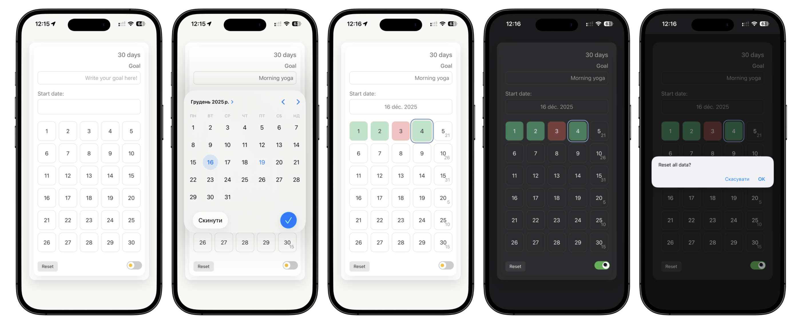
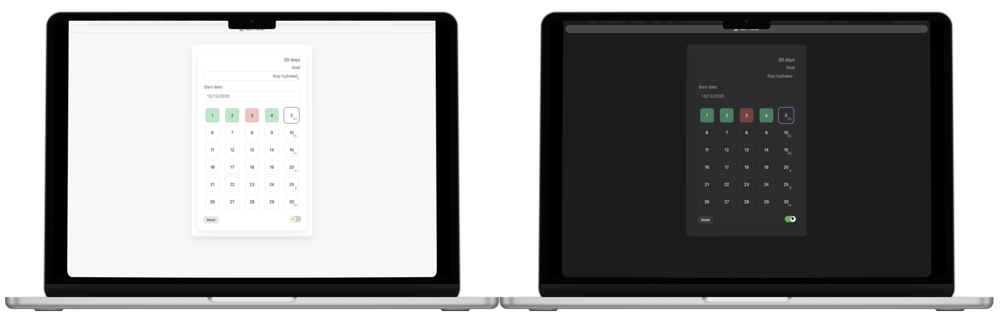

# 30 Days Habit Tracker

A simple habit tracker built with vanilla HTML, CSS, and JavaScript.

I originally tracked habits on paper, but needed something portable while traveling.
This project became a way to keep the habit simple and learn basic web development at the same time.

## Features
- 30-day visual grid
- Click to mark success / missed days
- Persistent state using localStorage
- Light / dark mode toggle
- Responsive design (desctop & mobile)
- Works offline after first load

## Use it like an app (iPhone)

You can add the tracker to your iPhone Home Screen:
1. Open the app in Safari
2. Tap the Share button
3. Select Add to Home Screen

It will behave like a standalone app📱

### Multiple trackers on the same device

If you add the app more than once to the Home Screen, each icon keeps its own independent tracker state.

This allows you to track different habits in parallel without extra setup.

## Motivation

This project was intentionally kept small and simple.

The goal was not to build a complex productivity system, but a calm, visual tool that is easy to use and easy to maintain — both as a habit tracker and as a learning exercise in web development.

## Live Demo
https://llisabere.github.io/30-days-habit-tracker/

## Screenshots

